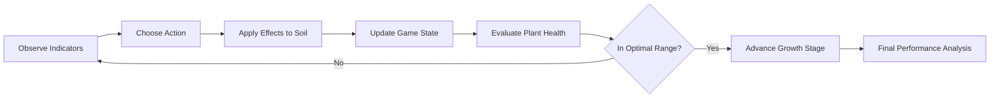

# 🌌 Space Agriculture Simulator

[](https://react.dev/) [](https://www.typescriptlang.org/) [](https://vitejs.dev/) [](https://tailwindcss.com/) [](LICENSE)

A learning-by-playing web game where you balance soil pH, nutrients (N-P-K), irrigation, temperature, and weather to grow a sustainable potato crop from soil prep to harvest in a futuristic space setting.

---

## 🧭 Table of Contents
- Overview
- Screenshots (placeholders)
- Features
- Gameplay Flow (diagram)
- Architecture (diagram)
- Component Responsibilities
- Tech Stack
- Installation
- Scripts
- How to Play (tips)
- Educational Value
- Roadmap
- FAQ
- Contributing
- License

---

## ✨ Overview
Space Agriculture Simulator teaches the fundamentals of sustainable agriculture through interactive mechanics and clear feedback. Your goal: keep plant health above 80% by maintaining soil and environmental conditions within optimal ranges and progress through all growth stages.

## 📸 Screenshots (placeholders)
- Add GIFs of the growth cycle and the action panel interactions
- Include a screenshot of indicators (pH, humidity, temperature, health)

## 🚀 Features
- Action panel: irrigate, fertilize (N-P-K), add compost, adjust pH, cool/warm soil
- Real-time indicators: pH, humidity, temperature, plant health, nutrient balance
- Growth stages with progress tracking and end-of-game performance analysis
- Environmental effects: day/night cycle and occasional rain
- Smooth visuals, subtle particle effects, and audio feedback

## 🎮 Gameplay Flow
High-level loop:
1) Observe indicators → 2) Choose action → 3) Soil adjusts → 4) Plant health responds → 5) Keep optimal ranges → 6) Advance stage → 7) Review results

Flow diagram:


## 🧱 Architecture
Core architecture focuses on a single source of truth for state and stateless visual components.

```mermaid
graph TD
    A[App.tsx] --> B[useGameLogic (hook)]
    B --> C[ActionPanel.tsx]
    B --> D[IndicatorPanel.tsx]
    B --> E[PlantVisualization.tsx]
    B --> F[ProgressBar.tsx]
    B --> G[ScorePanel.tsx]
    A --> H[EnvironmentalEffects.tsx]
    A --> I[EducationalTooltip.tsx]
    B --> J[data/growthStages.ts]
    B --> K[types/game.ts]
```

- App.tsx orchestrates layout and passes state/handlers from the main hook
- useGameLogic holds core state, side-effects, and action handlers
- Components render UI based on state and emit user events
- Data and Types modules provide growth config and type safety

## 🧩 Component Responsibilities
- ActionPanel: trigger actions (water, N-P-K, compost, pH, temperature)
- IndicatorPanel: live metrics for soil and plant
- PlantVisualization: visual growth representation by stage
- ProgressBar: stage and day progress
- ScorePanel: end-game summary and performance insights
- EnvironmentalEffects: day/night overlay and rain effects
- EducationalTooltip: contextual tips and learning snippets

References:
- <mcfile name="App.tsx" path="D:\danie\Bolt\Bolt\src\App.tsx"></mcfile>
- <mcfile name="useGameLogic.ts" path="D:\danie\Bolt\Bolt\src\hooks\useGameLogic.ts"></mcfile>
- <mcfile name="growthStages.ts" path="D:\danie\Bolt\Bolt\src\data\growthStages.ts"></mcfile>
- <mcfile name="game.ts" path="D:\danie\Bolt\Bolt\src\types\game.ts"></mcfile>

## 🛠️ Tech Stack
- React 18 + TypeScript
- Tailwind CSS
- Vite (dev/build)
- Lucide React icons

## ⚙️ Installation
Requirements: Node.js 16+, npm, Git

1. Clone the repository
```bash
git clone https://github.com/SrConej0/Space_Agriculture.git
cd Space_Agriculture
```
2. Install dependencies
```bash
npm install
```
3. Run development server
```bash
npm run dev
```
4. Open in browser at the URL printed in the terminal (e.g., http://localhost:5173/)

## 📜 Scripts
```bash
npm run dev       # Start development server
npm run build     # Build for production
npm run preview   # Preview the production build
npm run lint      # Run ESLint
npm run typecheck # Check TypeScript types
```

## 🧠 How to Play (tips)
- Keep pH: 5.5–6.5, humidity: 60–80%, temperature: 15–22°C
- Use actions sparingly; each has trade-offs
- Watch trends: if humidity is rising, pause irrigation
- Advance the stage when indicators are stable
- Read the final analysis to learn what worked and why

## 🎓 Educational Value
- Soil chemistry and nutrient balance
- Water management and conservation
- Plant growth stages for potato crops
- Environmental factors and their impact on agriculture
- Informed decision-making for sustainability

## 🗺️ Roadmap
- Story mode expansion with additional crops (quinoa, corn)
- Extra weather events (wind, storm)
- Achievements and missions
- Internationalization (EN/ES) with in-UI language switcher
- Accessibility mode (high contrast, descriptions)

## ❓ FAQ
- Does the game save progress? Session-only for now
- Can I add new crops? Yes—extend `src/data/growthStages.ts` and logic in the main hook
- Mobile support? Responsive UI adapts to small screens

## 🤝 Contributing
1. Fork the repo
2. Create a branch: `git checkout -b feature/your-feature`
3. Commit: `git commit -m "feat: add your change"`
4. Push: `git push origin feature/your-feature`
5. Open a Pull Request

## 📄 License
MIT. See `LICENSE` for details.
